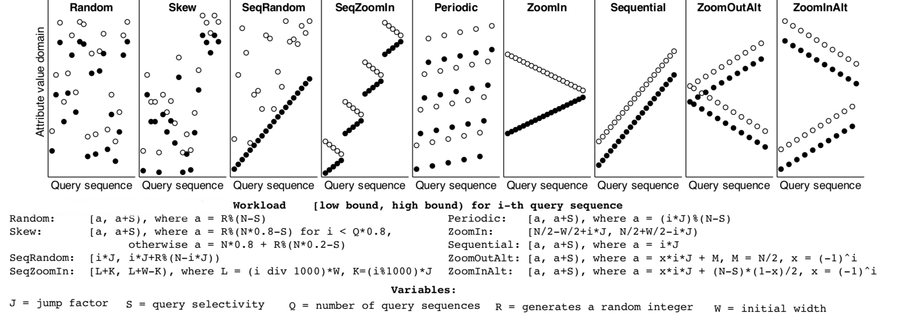
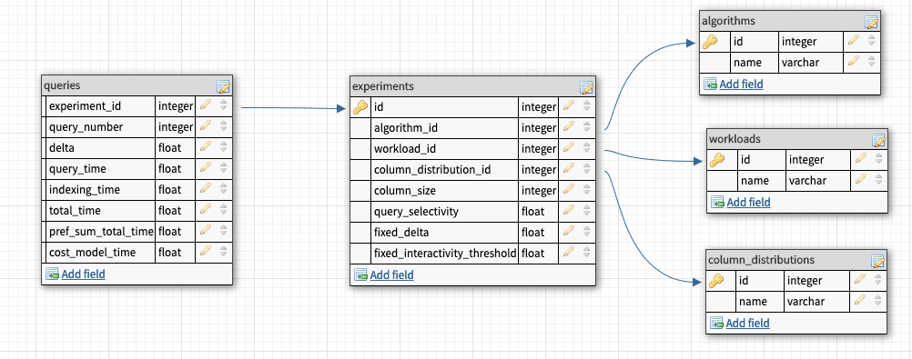

# Progressive Indexing
This project is a stand-alone implementation of all the current progressive indexing algorithms.

# Requirements
[CMake](https://cmake.org) to be installed and a `C++11` compliant compiler. Python 2.7 and SQLite are necessary to run all the automatic setup scripts.

# Available Indexing Algorithms
* [Standard Cracking](https://stratos.seas.harvard.edu/files/IKM_CIDR07.pdf)
* [Stochastic Cracking](http://www.cs.au.dk/~karras/StochasticDatabaseCracking.pdf)
* [Progressive Stochastic Cracking](http://www.cs.au.dk/~karras/StochasticDatabaseCracking.pdf)
* [Coarse Granular Index](www.vldb.org/pvldb/vol7/p97-schuhknecht.pdf)
* [Full Index (B+ Tree)](https://www.nowpublishers.com/article/Details/DBS-028)
* [Predicated Cracking](https://stratos.seas.harvard.edu/files/stratos/files/crackingscanorsort.pdf)
* [Rewired Cracking](https://bigdata.uni-saarland.de/publications/HSD18_DaMoN.pdf)
* [Adaptive Adaptive Indexing](https://bigdata.uni-saarland.de/publications/Adaptive_Adaptive_Indexing_ICDE18.pdf)
* Progressive Quicksort Fixed Delta
* Progressive Quicksort Self-Adjusting Delta
* Progressive Radixsort (MSD) Fixed Delta
* Progressive Radixsort (MSD) Self-Adjusting Delta
* Progressive Radixsort (LSD) Fixed Delta
* Progressive Radixsort (LSD) Self-Adjusting Delta
* Progressive Bucketsort (Equi-Height) Fixed Delta
* Progressive Bucketsort (Equi-Height) Self-Adjusting Delta

# Available Workloads

## SkyServer
The Sloan Digital Sky Survey is a project that maps the universe. The data set and interactive data exploration query logs are publicly available via the SkyServer website.
The data set contains almost 600 million tuples, with around 160,000 range queries that focus on specific sections of the domain before moving to different areas. The data distribution and the workload distribution are shown below:


## Synthetic 
The synthetic data set is composed of two data distributions, a random and a skewed one. They consist of n 8-byte integers distributed in the range of [0, n). All workloads consist of 10^5 queries in the form 
```sql
SELECT SUM(R.A) FROM R WHERE R.A BETWEEN low AND high
```
The values for low and high are chosen based on the workload pattern. The different workload patterns and their mathematical description are depicted in the figure below, originally from the [Stochastic Cracking](http://www.cs.au.dk/~karras/StochasticDatabaseCracking.pdf) paper.


# Running the experiments
There are two ways to run experiments. The automatic way sets up the whole environment, and stores the result in an SQLite database, it runs all the experiments used in the progressive indexing papers. Manually, all the process needs to be done from the command line, from compiling, generating data, workload and executing the experiments. The results are then printed in the console
## Automatic
 To automatically run all the experiments you need to run the following script:
```bash
python scripts/run_experiments.py
```
## Manual
The header for printed output:
delta(if progressive indexing);query processing time; index creation time ; total time; prefix sum; cost model cost

### Compile
First, we compile the code using release (-O3) mode
```bash
cmake -DCMAKE_BUILD_TYPE=Release && make
```
### Generate Data
* SkyServer:
The skyserver data and workload can be manually downloaded [here](https://zenodo.org/record/2557531#.XHpgpZNKjUI) 

* Syntethical :
    * column-size is an integer representing the size of the column.
    * column-path is the path where the generated column will be stored.
    * column-dist is the distribution for the generated column
        * 1 = Random
        * 2 = Skewed
```bash
./generate_column --column-size=(?)   --column-path=(?) --column-path=(?) --column-dist=(?)
```
Example:
```bash
./generate_column --column-size=10000000 --column-path=generated_data/10000000/column --column-dist=1
```

### Generate Workload
After generating the dataset, you can generate workload:
```bash
./generate_workload --num-queries=(?) --column-size=(?) --column-path=(?)  --query-path=(?) --answer-path=(?) --selectivity=(?) --queries-pattern=(?)
```
* num-queries is an integer representing the total amount of queries in the workload.
* column-size is an integer representing the size of the column.
* column-path is the path where the generated column is stored.
* query-path is the path where the generated queries will be stored.
* answer-path is the path where the generated query_answers will be stored. (This is used for correctness)
* selectivity is a float number representing the per-query selectivity. (10.0 means that every query has 10% of the whole domain [0,n) as their result])
* queries-pattern is the pattern the queries will follow.
     * 2 = Random
     * 3 = SeqOver
     * 4 = SeqRand
     * 5 = ZoomIn
     * 6 = SeqZoomIn
     * 7 = Skew
     * 8 = ZoomOutAlt
     * 9 = Periodic
     * 10 = ZoomInAlt
Example:
```bash
./generate_workload --num-queries=10000 --column-size=10000000 --column-path=generated_data/10000000/column --query-path=generated_data/10000000/query_0.01_2 --answer-path=generated_data/10000000/answer_0.01_2 --selectivity=0.01 --queries-pattern=2
```

### Run Experiments
After generating the data and the workload, you can run any of the implemented algorithms.:
All algorithms have the following parameters:
* num-queries is an integer representing the total amount of queries in the workload.
* column-size is the an integer representing the size of the column.
* column-path is the path where the generated column is stored.
* query-path is the path where the generated queries are stored.
* answer-path is the path where the generated query_answers are stored.
* algorithm is the id of the to-be-executed algorithm.

#### For Baseline Algorithms:
```bash
./main --num-queries=(?) --column-size=(?) --column-path=(?)  --query-path=(?) --answer-path=(?)  --algorithm=(?)
```
algorithm:
* 1 = Full Scan
* 2 = Full Index
* 3 = Standard Cracking
* 4 = Stochastic Cracking 
* 5 = Progressive Stochastic Cracking
* 6 = Coarse Granular Index

Example:
```bash
./main --num-queries=10000 --column-size=10000000 --algorithm=7 --column-path=generated_data/10000000/column --query-path=generated_data/10000000/query_10_2 --answer-path=generated_data/10000000/answer_10_2
```

#### For Progressive with fixed delta:
```bash
./main --num-queries=(?) --column-size=(?) --column-path=(?)  --query-path=(?) --answer-path=(?)  --algorithm=(?) --delta=(?)
```
* delta is a float to be used as fixed delta for the entire workload.
* algorithm
    * 7 = Progressive Quicksort
    * 9 = Progressive Bucketsort Equiheight
    * 11 = Progressive Radixsort LSD
    * 13 = Progressive Radixsort MSD
Example:
```bash
./main --num-queries=10000 --column-size=10000000 --algorithm=13 --column-path=generated_data/10000000/column --query-path=generated_data/10000000/query_10_2 --answer-path=generated_data/10000000/answer_10_2 --delta=0.2
```
#### For Progressive with self-adjusting delta:
```bash
./main --num-queries=(?) --column-size=(?)--column-path=(?) --query-path=(?) --answer-path=(?) --algorithm=(?) --interactivity-threshold=(?) --interactivity-is-percentage=(?)  --decay-queries=(?)
```
* interactivity-threshold is a float representing the fixed interactivity threshold
* interactivity-is-percentage is an integer representing if the interactivity threshold is a percentage of the full scan cost or time in seconds.
* decay-queries is the number of queries desired for full convergence (Note: If this is set then whatever is set on the fixed-interactivity variables are not used, and a variable threshold will be used to generate the desired decay)
* algorithm
    * 8 = Progressive Quicksort Cost Model
    * 10 = Progressive Bucketsort Equiheight Cost Model
    * 12 = Progressive Radixsort LSD Cost Model
    * 14 = Progressive Radixsort MSD Cost Model

Example with fixed interactivity:
```bash
./main --num-queries=158325 --column-size=585624220 --algorithm=8 --column-path=real_data/skyserver/skyserver.data --query-path=real_data/skyserver/query_0.1 --answer-path=real_data/skyserver/answer_0.1 --interactivity-threshold=0.8 --interactivity-is-percentage=1
```

Example with decaying interactivity:
```bash
./main --num-queries=158325 --column-size=585624220 --algorithm=8 --column-path=real_data/skyserver/skyserver.data --query-path=real_data/skyserver/query_0.1 --answer-path=real_data/skyserver/answer_0.1 --decay-queries=300
```

## Checking for Correctness
Check if all algorithms produce correct results for given experiment parameters. By default, it uses a 10^8 column, uniform distribution, and test all the synthetical workload patterns with 0.001 selectivity and 10k queries.
```bash
python scripts/run_correctness.py
```
# Analyzing the results
If the results are generated by the experiments script (scripts/run_experiments.py), all the results are stored in an SQLite instance (results.db) in the repo root. It can be queried/exported to python/r for plotting purposes. Below you can see the SQLite schema used to store the results.


# Third Party Code
* www.github.com/felix-halim/scrack
* www.bigdata.uni-saarland.de/publications/uncracked_pieces_sourcecode.zip
* https://bitbucket.org/holger/crackingscanvssort/downloads/
* https://github.com/BigDataAnalyticsGroup/RewiredCracking
* Adaptive Adaptive Indexing code was provided by the paper authors

# Papers
* [Progressive Indices: Indexing without prejudice (Ph.D. Worskhop@VLDB)](http://ceur-ws.org/Vol-2175/paper11.pdf)